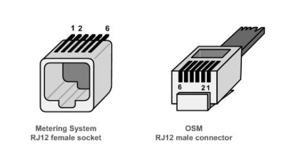
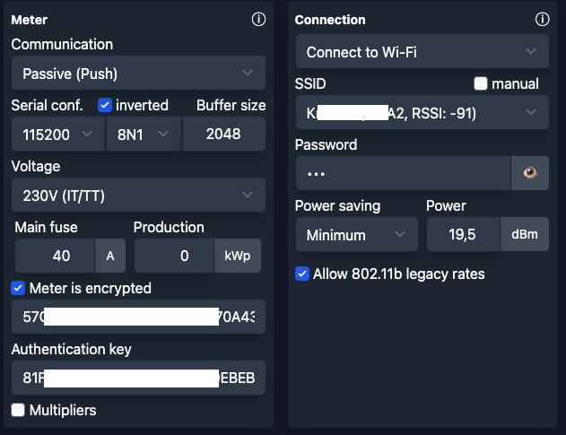

# Reading Stoen Gama 350 on ESP32 using AMS Reader Firmware

This project tries to put down all the steps required to read
the Stoen Gama 350 meter using an ESP32 and the AMS Reader Firmware.

## Sources:

- https://github.com/UtilitechAS/amsreader-firmware
- https://forum.arturhome.pl/t/elgama-gama-350-i-port-p1/13722
- https://github.com/mstuczko/pcb
- https://github.com/Egyras/esp32_p1meter

## My hardware

- ESP32-WROOM-32U DevKitC WiFi Bluetooth
- RJ12 6P6C Cable
- Capacitor 10V 1000UF
- Resistor 10KΩ
- Breadboard, jumper wires, etc.

## Wiring schema

### RJ12 Pins

Source: https://www.netbeheernederland.nl/sites/default/files/2024-02/dsmr_5.0.2_p1_companion_standard.pdf




| Pin # | Signal name  | Description                 | Remark                 |
|-------|--------------|-----------------------------|------------------------|
| 1     | +5V          | +5V            power supply | Power supply line      |
| 2     | Data Request | Data Request                | Input                  |
| 3     | Data GND     | Data ground                 |                        |
| 4     | n.c.         | Not connected               |                        |
| 5     | Data         | Data line                   | Output. Open collector |
| 6     | Power GND    | Power ground                | Power supply line      |

### Wiring diagram

```
       RJ 12                                                                        ESP32    
┌──────────────────┐                                                            ┌──────────┐
│ Pin 1 +5V        ┼────────────────────────────┬──────────────────────────────►│ VIN / 5V │
│──────────────────│                            ▼                               │──────────│
│ Pin 2 Data req.  ┼──────────────┐         Capacitor      ┌───────────────────►│ GND      │
│──────────────────│              │      (1000 µF / 10V)   │                    │──────────│
│ Pin 3 GND        ┼───────┐      │             ▲          │   ┌───────┬───────►│ GPIO16   │
│──────────────────│       │      │             │          │   │       │        │──────────│
│ Pin 4 n.c        │       ├──────┼─────────────┴──────────┘   │       ▼        │          │
│──────────────────│       │      │                            │    Resistor    │          │
│ Pin 5 Data line  ┼───────┼──────┼────────────────────────────┘      10KΩ      │          │
│──────────────────│       │      │                                    ▲        │──────────│
│ Pin 6 GND        ┼───────┘      └────────────────────────────────────┴───────►│ 3V3      │
└──────────────────┘                                                            └──────────┘
```

### Note: Pullup on Pin 2

As mentioned in the [https://github.com/UtilitechAS/amsreader-firmware/issues/1198#issuecomment-4925876283](docs)

> Pin2: [The DSMR P1 Companion Standard](https://www.netbeheernederland.nl/sites/default/files/2024-02/dsmr_5.0.2_p1_companion_standard.pdf) 
> (see paragraph 5.7.1) says it should be set to >= 4.0 V.

**However, it works for me with 3.3V.** If it works, I am not changing it.


## Software

1. Download `ams2mqtt-esp32-x.y.z.zip` from https://github.com/UtilitechAS/amsreader-firmware/releases
2. Use the `flash.sh`
3. Reboot the ESP32 and connect to the WiFi network created by the ESP32
4. Set it up using the web interface



**Note:** To me that part was really easy, so I am not sure what to write here.

## Photos

Coming up


